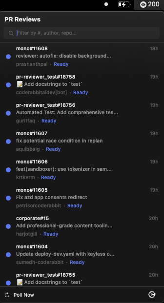

# PR Feed Widget

A macOS menu bar app that automatically reviews your GitHub org's open PRs using Claude and surfaces them in a compact, searchable feed.



## What it does

1. **Polls GitHub** for open PRs across your org on a configurable interval
2. **Spawns Claude reviews** — each PR gets a headless `claude -p` session that fetches the diff, explores the codebase, and writes a structured review
3. **Shows results in the menu bar** — click the icon to see all PRs sorted by date, with status indicators (reviewing, ready, failed, posted, dismissed)
4. **Click to engage** — opens an interactive Claude session (via iTerm2) where you can discuss the review, ask follow-ups, and refine comments before posting

Reviews run against your local repo clones via git worktrees, so Claude has full codebase context — not just the diff.

## Prerequisites

- macOS 14+
- [Claude Code CLI](https://docs.anthropic.com/en/docs/claude-code) (`claude` in PATH)
- [GitHub CLI](https://cli.github.com/) (`gh`) authenticated with your org
- [iTerm2](https://iterm2.com/) (for interactive review sessions)
- Swift 5.9+ / Xcode 15+ (for building the menu bar app)

## Install

```bash
git clone https://github.com/coderabbitai/pr-feed-widget.git
cd pr-feed-widget
./install.sh
```

This will:
- Symlink `pr-agent` to `~/.local/bin/pr-agent`
- Copy default config to `~/.pr-agent/config.yaml` (if it doesn't exist)
- Build the SwiftUI menu bar app
- Launch the menu bar app

## Configuration

Edit `~/.pr-agent/config.yaml`:

```yaml
# Which GitHub org to poll
github_org: your-org

# Repos to skip (test repos, forks, etc.)
skip_repos:
  - test-repo

# Map repo names to local clones for full code access during review
repos:
  my-app: ~/work/my-app
  my-api: ~/work/my-api

# Where review worktrees are created
reviews_dir: ~/pr-reviews

# Max simultaneous Claude review processes
max_concurrent_reviews: 2

# How long to keep completed sessions
retention_days: 30
```

### Review prompt

The review prompt is fully customizable — edit it in the config file or from the app via **Gear menu > Edit Review Prompt**. Available template variables:

| Variable | Replaced with |
|---|---|
| `{{repo}}` | Repository name |
| `{{pr_num}}` | PR number |
| `{{title}}` | PR title |
| `{{author}}` | PR author |
| `{{pr_url}}` | Full GitHub PR URL |
| `{{extra_instructions}}` | Per-PR instructions (from re-review) |

## Usage

### Menu bar app

The app lives in your menu bar and shows a badge with the count of PRs needing attention.

- **Click** a ready review to open an interactive Claude session in iTerm2
- **Right-click** for context menu: view on GitHub, re-review, dismiss, discard
- **Search** to filter by PR number, author, repo name, or title
- **Gear menu**: poll now, reset & re-poll, edit prompt, discard all, quit

### CLI

```bash
pr-agent poll              # Run one poll cycle
pr-agent list              # List all reviews
pr-agent list ready        # List reviews ready for you
pr-agent open mono-1234    # Open interactive Claude session for a PR
pr-agent discard all       # Wipe all reviews and start fresh
pr-agent discard 1234      # Discard a specific review
pr-agent re-review 1234    # Re-review with the existing session
pr-agent start             # Start background polling daemon (launchd)
pr-agent stop              # Stop daemon
pr-agent status            # Show daemon and session status
pr-agent clean             # Remove sessions older than retention_days
```

### Re-reviewing

Right-click a PR and choose **Re-review** to send follow-up instructions to the same Claude session. Or choose **Start Fresh** to discard and run a brand new review. You can also add quick tags like "Focus on: Security" or "Focus on: Performance".

## Architecture

```
pr-agent poll → GitHub Search API → pr-agent-review (per PR)
                                         ↓
                                    claude -p (headless)
                                         ↓
                                  ~/.pr-agent/sessions/
                                         ↓
                                  SwiftUI menu bar app
                                         ↓
                                  claude --resume (interactive, iTerm2)
```

Each review session lives at `~/.pr-agent/sessions/<org>-<repo>-<pr>/` with:
- `meta.json` — PR metadata, status, Claude session ID
- `review.md` — Claude's review output
- `comments.json` — Structured comments for posting

Reviews create git worktrees from your local repo clones (configured in `repos:`), so Claude can explore the full codebase — not just the diff.

## Screenshots

| Feed | Re-review |
|---|---|
|  |  |
